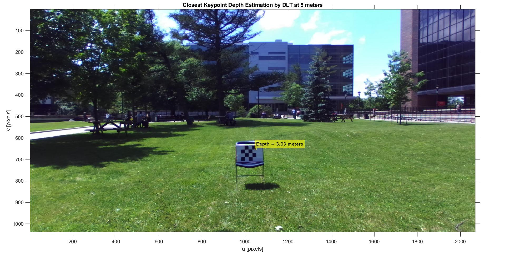
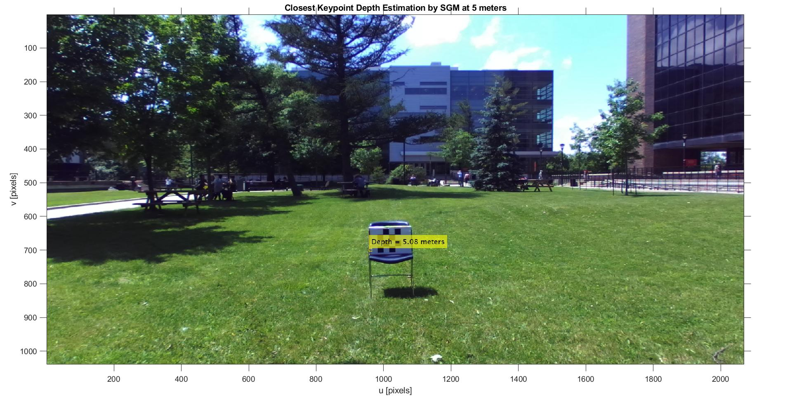

# ZED-and-ZED-Mini-Depth-Estimation-Evaluation

This repository is a MATLAB implementation as part of the the Master Thesis Project: [Sparse Stereo Visual Odometry with Local Non-Linear Least-Squares Optimization for Navigation of Autonomous Vehicles](https://curve.carleton.ca/7270ba62-1fd3-4f1b-a1fa-6031b06585e9) to evaluate depth estimation of ZED and ZED Mini stereo cameras for measurement purposes.

Tha code has been written and tested on [MATLAB 2019a](https://www.mathworks.com/?s_tid=gn_logo) and depends on the following toolboxes:
* Computer Vision Toolbox
* Image Processing Toolbox

The software was tested on a laptop `Inter(R) Core(TM) i7-6500U CPU @ 2.50GHz 2.60 GHz` and `12 GB RAM`

## Installation

1. Clone the repository using the following command

```bash
git clone https://github.com/FabianAC07/ZED-and-ZED-Mini-Depth-Estimation-Evaluation.git
```

2. Make sure that the `Data` folder contains the following subfolders:
```bash
"Data"
  |--"Indoor"
  |  |--"ZED"
  |  |  |--"720"
  |  |  |  |--"Left"
  |  |  |  |--"Right"
  |  |  |--"1080"
  |  |     |--"Left"
  |  |     |--"Right"
  |  |--"ZED-M"
  |  |  |--"720"
  |  |  |  |--"Left"
  |  |  |  |--"Right"
  |  |  |--"1080"
  |  |     |--"Left"
  |  |     |--"Right"
  |--"Outdoor"
  |  |--"ZED"
  |  |  |--"720"
  |  |  |  |--"Left"
  |  |  |  |--"Right"
  |  |  |--"1080"
  |  |     |--"Left"
  |  |     |--"Right"
  |  |--"ZED-M"
  |  |  |--"720"
  |  |  |  |--"Left"
  |  |  |  |--"Right"
  |  |  |--"1080"
  |  |     |--"Left"
  |  |     |--"Right"
  |--"ZED Calibration Files"
```

## Data Description

The data is organized based on the directory structure shown above, which means:
* Data is organized in Indoor and Outdoor environments
* Data is split into ZED and ZED Mini image captures
* Images were taken in "Full High Definition" (FHD or 1080 x 1920 p) and "High Definition" (FHD or 720 x 1280 p)
* Images are stored in Left and Right folders accordingly to their respective lens
* Images were captured in raw format (lens distortion included) and rectified from [ZED SDK](https://www.stereolabs.com/developers/release/)

The calibration files are organized as follow:
* `Custom_Calibration_ZED_Mini_SN10027514_FHD_1080.mat`: ZED Mini calibration file @ FHD  
* `Custom_Calibration_ZED_Mini_SN10027514_HD_720.mat`: ZED Mini calibration file @ HD
* `Custom_Calibration_ZED_SN21531_FHD_1080.mat`: ZED calibration file @ FHD
* `Custom_Calibration_ZED_SN21531_HD_720.mat`: ZED calibration file @ HD
* `ZED_Calibration_File.m`: ZED and ZED Mini Camera Parameters provided by StereoLabs 

*Note: `Custom_Calibration_*` files were obtained using the "Stereo Camera Calibrator App" included in MATLAB "Computer Vision Toolbox"*.

## Usage

1. Open the file `main.m` from `scr` folder and run it.

2. A pop up window will request user inputs:

<p align="center">
  
</p>

3. The software will calculate the depth based on the input parameters 

4. The results will be shown in image format

<p align="center">
  
</p>

<p align="center">
  
</p>

<p align="center">
  
</p>

## Further Reading

For details on the implemenation and use of this software please refer to chapters 1 to 4 from the M.A.Sc. Thesis ["Sparse Stereo Visual Odometry with Local Non-Linear Least-Squares Optimization for Navigation of Autonomous Vehicles"](https://curve.carleton.ca/7270ba62-1fd3-4f1b-a1fa-6031b06585e9)

## License

This software is under GNU General Public License v3.0 License.

If you use this software in an academic work, please cite:

E. F. Aguilar Calzadillas, "Sparse Stereo Visual Odometry with Local Non-Linear Least-Squares Optimization for Navigation of Autonomous Vehicles", M.A.Sc. Thesis, Depart. of Mech. and Aero. Eng., Carleton University, Ottawa ON, Canada, 2019.
